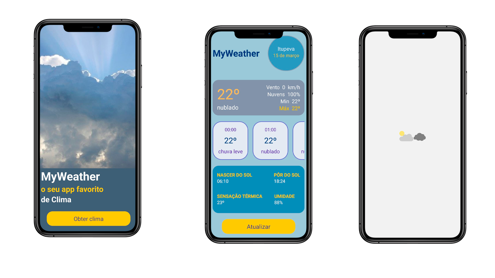

<h1 align="center">
  
</h1>

<h3 align="center">
  React Native Application for MyWeather project
</h3>

<p align="center">Your favorite Weather App!</p>

<p align="center">
  <a href="#%EF%B8%8F-about-the-project">About the project</a>&nbsp;&nbsp;&nbsp;|&nbsp;&nbsp;&nbsp;
  <a href="#-technologies">Technologies</a>&nbsp;&nbsp;&nbsp;|&nbsp;&nbsp;&nbsp;
  <a href="#-getting-started">Getting started</a>&nbsp;&nbsp;&nbsp;|&nbsp;&nbsp;&nbsp;
  <a href="#-how-to-contribute">How to contribute</a>&nbsp;&nbsp;&nbsp;|&nbsp;&nbsp;&nbsp;
  <a href="#-license">License</a>
</p>


##  📰About the project

<h1 align="center">
  
</h1>

🌥️A weather app where the user gets the region's weather data based on their location, using the openweathermap API

Project in development

## 🚀 Technologies

Technologies that I used to develop this mobile client

- [ReactJS](https://reactjs.org/)
- [TypeScript](https://www.typescriptlang.org/)
- [React Native](https://reactnative.dev/)
- [React Navigation](https://reactnavigation.org/)
- [React Native Vector Icons](https://github.com/oblador/react-native-vector-icons)
- [styled-system](https://styled-system.com/)
- [Styled Components](https://styled-components.com/)
- [Axios](https://github.com/axios/axios)
- [Redux](https://redux.js.org/introduction/getting-started)
- [Redux-Saga](https://redux-saga.js.org/)
- [Geolocation](https://github.com/Agontuk/react-native-geolocation-service)
- [Moment](https://www.npmjs.com/package/react-moment)
- [Lottie](https://lottiefiles.com/featured?gclid=Cj0KCQjwz7uRBhDRARIsAFqjulnP_NdqZXG922tfhAvcGEUDy3jT-D4bZmx2V3z15nSz6NYG67R_X1QaAivoEALw_wcB)
- [React Native Reanimated](https://www.npmjs.com/package/react-native-reanimated)
- [Jest](https://jestjs.io/docs/25.x/tutorial-react-native)
- [Eslint](https://eslint.org/)
- [Prettier](https://prettier.io/)
- [EditorConfig](https://editorconfig.org/)

## 💻 Getting started

### Requirements


**Clone the project and access the folder**

```bash
$ git clone https://github.com/bruno07dev/myweatherapp.git && cd myweatherapp
```

**Follow the steps below**

```bash
# Install the dependencies
$ yarn

# If your android studio emulator is already open, run this command
$ npx react-native run-android

# If you are going to emulate with android, run this command
# Be sure to have the emulator open
$ yarn android

# If you are going to emulate with ios, run this command
$ yarn ios
```

## 🤔 How to contribute

**Make a fork of this repository**

```bash
# Fork using GitHub official command line
# If you don't have the GitHub CLI, use the web site to do that.

$ gh repo fork bruno07dev/myweatherapp
```

**Follow the steps below**

```bash
# Clone your fork
$ git clone your-fork-url && cd myweatherapp

# Create a branch with your feature
$ git checkout -b my-feature

# Make the commit with your changes
$ git commit -m 'feat: My new feature'

# Send the code to your remote branch
$ git push origin my-feature
```

After your pull request is merged, you can delete your branch

## 📝 License

This project is licensed under the MIT License - see the [LICENSE](LICENSE) file for details.

---

> Status Project: Project in development :heavy_check_mark:
# 🎬 Desenvolvedores

[ <br> <sub> Bruno Cardoso </sub>](https://www.linkedin.com/in/bruno-s-cardoso/) |
| :---: |

Made with 💜 by Bruno Cardoso 👋
